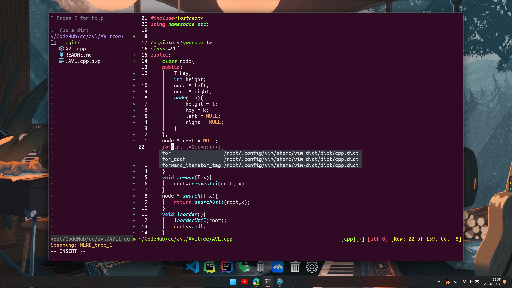
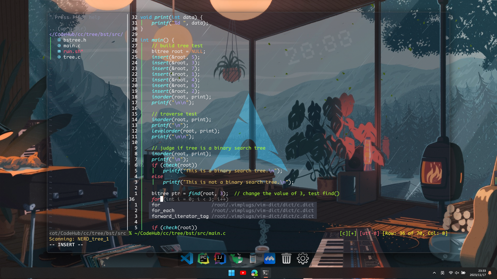
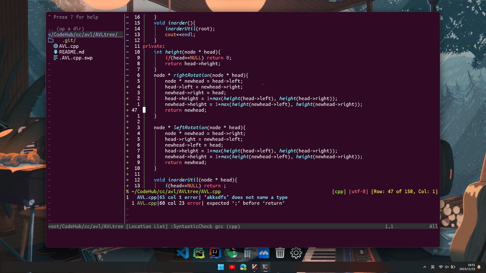

# HugoVim 😀🚀

This project aim to provide a sub-IDE-like vim(light, structured and strong) for vim users. Hope that more people will fall in love with Vim through this project😀😀😀.



---

Table of Contents
=================

* [HugoVim 😀🚀](#hugovim-)
   * [Environment🌏](#environment)
   * [Installation✌️😎](#installation️)
   * [How to use (I mean how to change config of it so that you can make yor own vim🚀)](#how-to-use-i-mean-how-to-change-config-of-it-so-that-you-can-make-yor-own-vim)
      * [1. ~/.vimrc](#1-vimrc)
      * [2. ~/.config/vim](#2-configvim)
      * [3. ~/.config/vim/config](#3-configvimconfig)
         * [3.1. init.vim](#31-initvim)
         * [3.2. color settings](#32-color-settings)
         * [3.3. diy functions](#33-diy-functions)
         * [3.4. keymaps](#34-keymaps)
         * [3.5. plugins](#35-plugins)
   * [screenshots](#screenshots)


## Environment🌏

- wsl ubuntu-22.04
- vim >= 9.0
- git

## Installation✌️😎

What you should do is very simple, just follow the following steps:  
1. install git  
```bash
sudo apt install git
```
2. make sure there are no files names .vimrc under your home directory and no dir called vim in .config 
```bash
mv ~/.vimrc ~/.vimrc.bak
mv ~/.config/vim ~/.config/vim.bak
```
3. donwload & run install script  
```bash
curl -fLo ~/.vim/autoload/plug.vim --create-dirs https://raw.githubusercontent.com/junegunn/vim-plug/master/plug.vim
```
4. get into vim and run following commands 
```vim
" download all plugins (it may take a while)
:PlugInstall 

" quit, then enter again ...  

" 1. login codium AI (proxy needed)
:Codium Auth 

" 2. init markdown-preview
:call mkdp#util#install()
```
5. ***Join it !!!*** 😋😍😍😍

## How to use (I mean how to change config of it so that you can make yor own vim🚀)

The mechanism of vim config starts from `~/.vimrc` file under your home directory. All the configs will load from this file. However, in order to make it more structured, we devide the original whole file to many parts as the form of fils and directories and move all of them to the `~/.config/vim` directory. Now I will introduce you the structure of configs.  

### 1. ~/.vimrc 
only one line in this file to import all configs in the directory `~/.config/vim`:   
```vim
import '~/.config/vim/config/init.vim'
```

### 2. ~/.config/vim
```
~/.config/vim    
├── README.md  
├── config  
├── install.sh   
└── share   
```

there are two sub-directories: `config` and `share`. Among them `config` is the config of vim and `share` is the place we strore all plugins so we can make it isolated with system.

### 3. ~/.config/vim/config
```
config  
├── colors.vim  
├── diy  
│   ├── code_runner.vim   
│   ├── comment.vim   
│   ├── indent.vim   
│   └── remember.vim   
├── diy.vim   
├── init.vim  
├── keymaps.vim   
├── plugins  
│   ├── completion.vim   
│   ├── dbui.vim   
│   ├── indentLine.vim   
│   ├── mkdp.vim   
│   ├── nerdtree.vim   
│   └── syntatic.vim   
└── plugins.vim   
```
this is the main part what I wnat to introduce.   
I want to separate the config of vim to five parts, they are: ***color settings, diy functions, init(main file), keymaps and plugins.***
#### 3.1. init.vim  
this is the main file of all configs. It contains import sentences of other modules, and some basic settings.
!!! notice that you can not change the order of import modules randomly! especially the `keymaps.vim` and `plugins.vim`. So I suggest you do not change this file unless you know what you are doing.     


#### 3.2. color settings
this part is writen in `colors.vim`, including 'which colorscheme to use', 'other settings to make our code more beautiful' and 'a simple statusline writen in vim', if you have your own opinion, you can change it in `colors.vim` directly.    


#### 3.3. diy functions
this part is writen in `diy.vim`, including 'code runner', 'comment', 'indent', 'remember'. The details of each function are stored in folder `diy\`. If you want to add new function, just create source file in `diy\` and import it in `diy.vim` as I have done.  
Here are the functions of what I have add to `diy.vim`:  

- `code_runner`: run code by simple type `ctrl-b`, you can add more file-type in `code_runner.vim` and change the run way according to your own conditions. Currently support(and eviroment requirements) :    
```
filetype:env = [ 
    'verilog':['iverilog', 'gtkwave'], 
    'c':'clang', 
    'cpp':'clang++',
    'python':'python3',
    'rust':'cargo',
    'java':'javac',
    'sh':'bash',
    'sql':'mysql' 
]
```

- `comment`: comment code under visual mode by simple type `ctrl-/`, and cancel it by `ctrl-/` too. There is some other options: `ctrl-j` to comment and `ctrl-k` to uncomment. There is only a litte difference between these two ways: the former will add comment at '^' and the latter will add comment at '0'(I assume that you know the meaning of '^' and '0'). For example, if you want to add comment to a cpp snippet: 
```cpp
void bubble_sort(int *a, int n) {
    for (int i = 0; i < n; ++i) 
        for (int j = 0; j < n - i - 1; ++j)
            if (a[j] > a[j + 1])
                std::swap(a[j], a[j + 1]);
}
```
now we select line 2 ~ 5, if we use `ctrl-/`, we will get:  
```cpp
void bubble_sort(int *a, int n) {
    // for (int i = 0; i < n; ++i) 
        // for (int j = 0; j < n - i - 1; ++j)
            // if (a[j] > a[j + 1])
                // std::swap(a[j], a[j + 1]);
}
```
but if you use `ctrl-j`, we will get:  
```cpp
void bubble_sort(int *a, int n) {
    // for (int i = 0; i < n; ++i) 
    //     for (int j = 0; j < n - i - 1; ++j)
    //         if (a[j] > a[j + 1])
    //             std::swap(a[j], a[j + 1]);
}
```
but for uncomment, those two ways are same.  

- `indent`: simple indent style controller, this will atomatically switch the style of indent between '2' and '4' according to filetype.   

- `remember`: remember the line position of cursor.      


#### 3.4. keymaps
self defined keymaps is one of the most charm of vim. It is writen in `keymaps.vim`. And you can add your own keymaps in `keymaps.vim` directly. Here are some default keymaps added by me:   

| Mode    | Short Cut | Mean                                      | Mapped To                                    | Type     |
| ------- | --------- | ----------------------------------------- | -------------------------------------------- | -------- |
| Insert  | `jk`      | Exit insert mode                          | `<Esc>`                                      | System   |
| Insert  | `Ctrl+s`  | Save                                      | `:w<CR>a`                                    | System   |
| Insert  | `'`       | Insert '' in insert mode                  | `''<Left>`                                   | System   |
| Insert  | `"`       | Insert "" in insert mode                  | `""<Left>`                                   | System   |
| Insert  | `(`       | Insert () in insert mode                  | `()<Left>`                                   | System   |
| Insert  | `[`       | Insert [] in insert mode                  | `[]<Left>`                                   | System   |
| Insert  | `{`       | Insert {} in insert mode                  | `{}<Left>`                                   | System   |
| Insert  | `{+Enter` | Insert {} in insert mode                  | `{}<Left><CR><Esc>O`                         | System   |
| Insert  | `gb`      | Go back to last change                    | `<Esc>u<C-r>a`                               | System   |
| Normal  | `JK`      | Quit vim                                  | `:q<CR>`                                     | System   |
| Normal  | `Ctrl+a`  | Select all                                | `gg0vG$`                                     | System   |
| Normal  | `Ctrl+s`  | Save                                      | `:w<CR>`                                     | System   |
| Normal  | `Ctrl+j`  | Jump between windows, move down           | `<C-W>j`                                     | System   |
| Normal  | `Ctrl+k`  | Jump between windows, move up             | `<C-W>k`                                     | System   |
| Normal  | `Ctrl+h`  | Jump between windows, move right          | `<C-W>h`                                     | System   |
| Normal  | `Ctrl+l`  | Jump between windows, move left           | `<C-W>l`                                     | System   |
| Normal  | `Ctrl+c`  | Copy to clipboard                         | `:silent w !clip.exe<CR>`                    | System   |
| Normal  | `H`       | Move to line start                        | `^`                                          | System   |
| Normal  | `L`       | Move to line end                          | `$`                                          | System   |
| Normal  | `U`       | Redo                                      | `<C-r>`                                      | System   |
| Normal  | `<leader>mm` | Remove highlight                         | `:noh<CR>`                                  | System   |
| Normal  | `Alt+j`   | Move line down                            | `ddp`                                        | System   |
| Normal  | `Alt+k`   | Move line up                              | `ddkkp`                                      | System   |
| Normal  | `<leader>h`| Open terminal horizontally               | `:ter<CR><C-w><C-r><C-\><C-n>:resize -3<CR>i` | System   |
| Normal  | `<leader>v`| Open terminal vertically                 | `:set nowrap<CR>:vert ter<CR><C-w><C-r>`    | System   |
| Normal  | `F3`    | Toggle scrollbind                         | `:set scrollbind<CR>`                        | System   |
| Normal  | `Shift+F3`  | Toggle scrollbind off                     | `:set noscrollbind<CR>`                      | System   |
| Normal  | `gb`      | Go back to last change                    | `u<C-r>`                                    | System   |
| Normal  | `Tab`   | Next buffer                               | `:bnext<CR>`                                | System   |
| Normal  | `Shift+Tab` | Previous buffer                           | `:bprevious<CR>`                            | System   |
| Normal  | `<leader>fo` | Open old files                           | `:browse oldfiles<CR>`                       | System   |
| Normal  | `<leader>x`| Close buffer                              | `:bdelete<CR>`                              | System   |
| Normal  | `<leader>ff` | Open file manager                       | `:Files<CR>`                                | System   |
| Normal  | `<leader>so` | Reload vimrc                              | `:w!<CR>:so %<CR>`                          | System   |
| Normal  | `<leader>mp` | Open keymaps.vim                         | `:e ~/.config/vim/config/keymaps.vim<CR>`   | System   |
| Normal  | `<leader>g` | Trigger git command mode                  | `:Git`                                      | System   |
| Normal  | `Ctrl+b`  | Run Code Runner                          | `:call CodeRunner()`                          | Diy      | 
| Normal  | `Ctrl+/`  | Toggle Comment                           | `:call ToggleComment()`                       | Diy      |
| Normal  | `<leader>j` | Comment                                | ` `                                           | Diy      |
| Normal  | `<leader>k` | Uncomment                              | ` `                                           | Diy      |
| Visual  | `q`       | Exit visual mode                          | `<Esc>`                                      | System   |
| Visual  | `"`       | Wrap selected by `"`                      | `hdi"<Esc>pla"<Esc>l`                        | System   |
| Visual  | `'`       | Wrap selected by `'`                      | `hdi'<Esc>pla'<Esc>l`                        | System   |
| Visual  | `(`       | Wrap selected by `()`                     | `hdi(<Esc>pla)<Esc>l`                        | System   |
| Visual  | `[`       | Wrap selected by `[]`                     | `hdi[<Esc>pla]<Esc>l`                        | System   |
| Visual  | `{`       | Wrap selected by `{}`                     | `hdi{<Esc>pla}<Esc>l`                        | System   |
| Visual  | \`       | Wrap selected by `` ` ``                   | `hdi`<Esc>pla`<Esc>l`                        | System   |
| Visual  | `<`       | Move visual block left                    | `<gv>`                                      | System   |
| Visual  | `>`       | Move visual block right                   | `>gv>`                                      | System   |
| Visual  | `Ctrl+c`   | Copy selected to clipboard               | `:silent w !clip.exe<CR>`                   | System   |
| Visual  | `H`       | Select to line start                      | `^`                                          | System   |
| Visual  | `L`       | Select to line end                        | `$`                                          | System   |
| Terminal | `Ctrl+x` | Exit terminal mode                        | `<C-\><C-n>`                                | System   |
| Terminal | `<leader>q`| Close terminal                            | `<C-\><C-n>:q!<CR>:set wrap<CR>`            | System   |
| Terminal | `Ctrl+h` | Jump from terminal to normal, jump left    | `<C-w>h`                                 | System   |
| Terminal | `Ctrl+l` | Jump from terminal to normal, jump right   | `<C-w>l`                                | System   |
| Terminal | `Ctrl+j` | Jump from terminal to normal, jump down    | `<C-w>j`                                | System   |
| Terminal | `Ctrl+k` | Jump from terminal to normal, jump up      | `<C-w>k`                                 | System   |
| Normal | `sp`       | Previous Error                             | `:LocationPrevious<CR>`                    | Syntastic |  
| Normal | `sn`       | Next Error                                 | `:LocationNext<CR>`                        | Syntastic |
| Normal | `<Leader>ec`| Toggle Syntastic | `:SyntasticToggleMode<CR>`                                          | Syntastic |
| Normal | `<leader>m`| Open/Close Markdown Preview         | `:MarkdownPreviewToggle<CR>`                      | Markdown-Preview |
| Normal | `Ctrl+n`   | Open/Close NERDTree                      | `:NERDTreeToggle<CR>`                        | NERDTree  |
| Insert  | `Ctrl+]` | Accept suggestions by codeium AI   | `codeium#Accept()`                                  | Codium   |
| Insert  | `Ctrl+Shift+j`   | Next suggestions by codeium AI            | `call codeium#CycleCompletions(1)`          | Codium   |
| Insert  | `Ctrl+Shift+k`   | Previous suggestions by codeium AI        | `call codeium#CycleCompletions(-1)`         | Codium   |
| Insert  | `Ctrl+x`   | Clear suggestions by codeium AI           | `call codeium#Clear()`                      | Codium   |
| Normal | `F4`  | Open/Close indent line                    | `:IndentLinesToggle<CR>`                    | Indent Lines |

#### 3.5. plugins
In this project I have donwload vim-plug as plugin manager and prepare some plugins for you to use. And the config of these plugins are in `~/.config/vim/config/plugins.vim`.    
here are the links of them :   

| Feature Description                        | Plugin Link                                                                       |
| ----------------------------------------   | ---------------------------------------------                                     |
| Auto Completion                            | [vim-auto-popmenu](https://github.com/skywind3000/vim-auto-popmenu)               |
| Dictionary Completion                      | [vim-dict](https://github.com/skywind3000/vim-dict)                               |
| Codeium                                    | [codeium.vim](https://github.com/Exafunction/codeium.vim)                         |
| Enhanced C++ Syntax Highlighting           | [vim-cpp-enhanced-highlight](https://github.com/octol/vim-cpp-enhanced-highlight) |
| Syntax Checking                            | [syntastic](https://github.com/vim-syntastic/syntastic)                           |
| Indent Line                                | [indentLine](https://github.com/Yggdroot/indentLine)                              |
| Improved Comments                          | [vim-better-comments](https://github.com/jbgutierrez/vim-better-comments)         |
| Fugitive (Git Plugin)                      | [vim-fugitive](https://github.com/tpope/vim-fugitive)                             |
| Git Gutter (Git Status in the Sign Column) | [vim-gitgutter](https://github.com/airblade/vim-gitgutter)                        |
| FZF (Fuzzy Search)                         | [fzf](https://github.com/junegunn/fzf)                                            |
| FZF.vim (Fuzzy Search Plugin)              | [fzf.vim](https://github.com/junegunn/fzf.vim)                                    |
| Markdown Preview                           | [markdown-preview.nvim](https://github.com/iamcco/markdown-preview.nvim)          |
| Mathjax Support (Markdown Preview Plugin)  | [mathjax-support-for-mkdp](https://github.com/iamcco/mathjax-support-for-mkdp)    |
| Database Operations (Dadbod)               | [vim-dadbod](https://github.com/tpope/vim-dadbod)                                 |
| Database UI (Dadbod UI)                    | [vim-dadbod-ui](https://github.com/kristijanhusak/vim-dadbod-ui)                  |
| Show CSS Color                             | [vim-css-color](https://github.com/ap/vim-css-color)                              |
| Sonokai (Theme)                            | [sonokai](https://github.com/sainnhe/sonokai)                                     |
| Align Text                                 | [tabular](https://github.com/godlygeek/tabular)                                   |
| NerdTree (File Tree)                       | [nerdtree](https://github.com/preservim/nerdtree)                                 |
| Devicons (Icon Support)                    | [vim-devicons](https://github.com/ryanoasis/vim-devicons)                         |

## screenshots  
1. on wsl archlinux  


2. on wsl ubuntu2204   


***These are all I want to introduce, let's begain your adventure !!!*** 😀🚀


